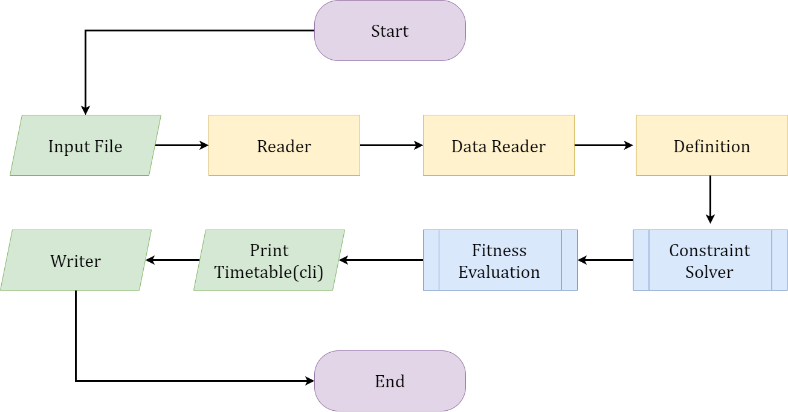
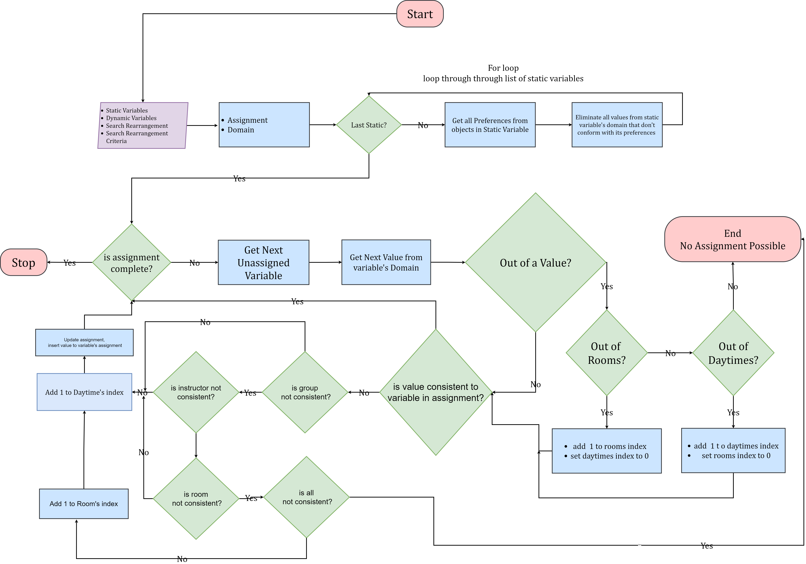

# Python Constraint Scheduler

## Introduction

A Timetable generator using `Constraint Programming` to develop optimum solutions while still
taking into account user preferences.The project is built with expansion in mind, to be able to
incoparate more algorithms in thefuture.

This is done by first represnting the initial values in a json file, after which an encoder
converts it into Objects that the algorithim can understand and use to find a solution.
The Objects include:

    1.`Room`
    2. `Instructor`
    3. `Group`
    4. `Unit`

## Definition of terms

- **Room** - An Object that represents the physical space where an action takes place
- **Instructor** - An Object that represents a person in charge
- **Group** - An Object that represents an audience
- **Unit** - An Object that represents a module to be taught
- **Session** - A fully filled Object containing a `Unit`, `Group`, `Time`, `Day`, `instructor` and `room`
- **Timetable** - A collection of completed `sessions`
- **Constraint Solver** - A `Constraint Programming` algorithm
- **Encoding** - Converting into an organised formart
- **Fitness Evaluation** - Checking how good a timetable is
- **Preference** - A user defined constraint, read `Preferences.md` for more
- **Variable** - A structure that defines an object that requires to be given
- **value** - An Object containing a single `Room` and  `DayTime`
- **assignment** A structure containg all the variables and their acompapaning values
- **Domain** - A structure that contains the `values` a `variable` can take

## Process

1. **Reader**
   - Convert Json File into python dictionaries, lists etc
2. **DataReader**
   - Encoding to the different Objects and reading configuration
3. **Definition**
   - Divide the differrent Objects into
4. **Constraint Solver**
   - A constraint Programming implementation to solve the problem, read  *`ConstraintProgramming.md`* for more
5. **Fitness Evaluation**
   - An implementation to test how goos the solution is
6. **Timetable Printer (terminal)**
   - Printing to the screen(Command Line)

> *Works optimally for days not exceeding three*

7. **Writer**
   - writes the timetable to a `json` file

## File Structure

The file structure of the project is intentional, largely due to oraganization and keeping up with the number of classes and functions and the role they play.
The folders in the root are

1. **Assets**
   - Holds all Filehandling Capabilities i.e Read and Write
   - Also holds utility functions that might be used anywhere in the project multiple times
2. **Data**
   - All Data Handling Functions and where all data is stored in json files
     - **Data Generator** - Used to create a new data input file, either randomly or with the option to guide the generator to create how many objects
     - **Inputs** - Where all the input data is placed
     - **Outputs** - Where all output data will be placed
     - **Parser** - Where the logic for converting Dictionaries into Objects
3. **Errors**
   - Where all the custom exceptions and errors are placed
4. **Logic**
   - Here we have the structures used to propaget the models
5. **Models**
   - Here we have the various Algorithims used to make timetables possible
6. **Objects**
   - Here we have some custom classes built for Objects including
     a. `Units`
     b. `Preferences`
     c. `Group` (of students) and `Instructors`
     d. `Rooms`

## Constraint Solver

### Introduction

A constraint Solver is the basic solution to a Constraint Programming whereby the solver searches a solution problem in an attempt to find an optimal solution while maitining `constraints`

The solution offered in this project tries to tackle **timetables** or **scheduling** (as a general concept)

I tackled this with  `node consistency` and `recursive backtracking` in that order

### Node Consistency

Node Consistency aims to satisfy unary constraints for variables in a search space *domain.* In this case taking whatever preference each session is affected by from the individual "`Objects`" (`Unit`, `Instructor`, `Group` and `room`) and eliminates them in the domain space.

This does not necessarily create a complete an assignment but is the only process where the preferences can be maintained.

### Recursive Backtracking

Recursive Backtracking loops through all the  static variables and tries to find an acceptable value for each by looping through its domain.

